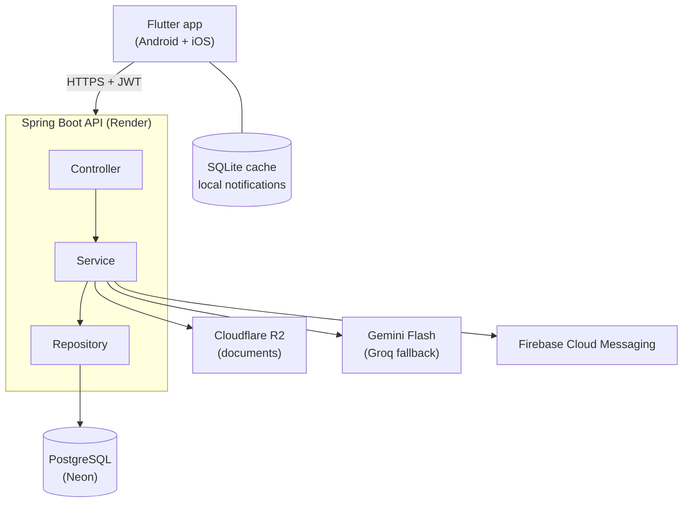

# Drivon

**A personal vehicle companion for Android and iOS.** Drivon keeps every fill-up, service, expense, document and renewal for your vehicles in one place, then turns that data into the numbers that matter: real km/L, cost per kilometre, monthly spending and upcoming reminders. An in-app assistant, *Ask My Vehicle*, answers plain-language questions using your own data.

[](https://github.com/Rimaz17/drivon/actions/workflows/backend-ci.yml)
[](https://github.com/Rimaz17/drivon/actions/workflows/frontend-ci.yml)
[](LICENSE)

> **Status:** Phases 1–5 are complete: accounts, up to two vehicles with an odometer history, fuel tracking with km/L and fuel cost per km, service records with upcoming services, expenses with spending totals by period, category, month and vehicle, vehicle documents (photos and PDFs) stored privately on Cloudflare R2 with expiry tracking, and an Insights tab with running cost per km (fuel, maintenance, other), monthly cost and efficiency charts, and a two-vehicle comparison. Features land phase by phase; see the [roadmap](#roadmap).

## Features (MVP)

| Module | What it does |
|---|---|
| Vehicles | Up to 2 vehicles per user (make, model, year, registration, fuel type, odometer) with a switcher |
| Fuel tracking | Litres, amount, price/L, odometer, station, full or partial fill; km/L by the full-tank method, fuel cost per km, monthly and total fuel spend |
| Maintenance | Service history with next service date and mileage, and what is due next |
| Expenses | Fuel, maintenance, repairs, insurance, parking, tolls, washing and other; monthly/yearly/category totals |
| Analytics | Efficiency trends, monthly costs, category split and cost per km, with vehicle comparison |
| Documents | Insurance, revenue licence, registration, invoices and receipts stored privately in Cloudflare R2 |
| Smart reminders | Date-based and mileage-based reminders with push and local notifications |
| Ask My Vehicle | Natural-language questions answered through read-only backend tool calls on your real data |

Units are kilometres, litres and Sri Lankan Rupees (`Rs. 18,500`).

## Architecture



The app only talks to the API. Every secret (database, AI, storage, Firebase) lives in backend environment variables; nothing sensitive ships inside the app. The backend is the single source of truth for all calculations.

## Tech stack

| Layer | Choice |
|---|---|
| Mobile | Flutter 3.44 (Dart 3.12), Riverpod, go_router, Material 3 with a custom dark design system |
| Backend | Java 17, Spring Boot 4.1, Spring Security (stateless JWT), Spring Data JPA, Flyway, springdoc-openapi |
| Database | PostgreSQL 17 (Neon in production, Docker locally) |
| Storage / AI / Push | Cloudflare R2, Google Gemini Flash + Groq, Firebase Cloud Messaging |
| Quality | JUnit 5, Mockito, Testcontainers, Spotless (google-java-format), flutter_lints, widget tests |
| Delivery | Docker, Docker Compose, GitHub Actions (API tests, Android build, iOS build), Render |

## Getting started

### Prerequisites

- Java 17 (Temurin recommended)
- Flutter 3.44.7 (stable)
- Docker Desktop (for Postgres and the Testcontainers tests)
- Android Studio or an Android device for running the app

### Run the backend

```bash
cp backend/.env.example .env       # local-only values; never commit .env
docker compose up -d postgres      # Postgres 17 on localhost:5433
cd backend && ./mvnw spring-boot:run
```

Or run everything in containers with `docker compose up --build`. The API listens on <http://localhost:8080>:

- Health: <http://localhost:8080/actuator/health>
- Swagger UI: <http://localhost:8080/swagger-ui.html>

### Run the app

```bash
cd frontend
flutter pub get
dart run build_runner build --delete-conflicting-outputs       # generated models are not committed
flutter run --dart-define=API_BASE_URL=http://10.0.2.2:8080   # Android emulator → host machine
```

On a USB-connected phone, run `adb reverse tcp:8080 tcp:8080` first and use `API_BASE_URL=http://localhost:8080`. The [frontend README](frontend/README.md#running-on-an-android-phone-from-android-studio) has step-by-step Android Studio instructions.

See [`backend/README.md`](backend/README.md) and [`frontend/README.md`](frontend/README.md) for details.

## Environment variables

All variables are listed with placeholders in [`backend/.env.example`](backend/.env.example) (copy it to `.env` at the repo root).

| Variable | Used by | Purpose |
|---|---|---|
| `POSTGRES_DB`, `POSTGRES_USER`, `POSTGRES_PASSWORD`, `POSTGRES_PORT` | Docker Compose | Local database |
| `API_PORT` | Docker Compose | Host port for the containerised API |
| `SPRING_PROFILES_ACTIVE` | Backend | `dev` locally, `prod` on Render |
| `DB_URL`, `DB_USERNAME`, `DB_PASSWORD` | Backend | Database connection (Neon needs `sslmode=require`) |
| `JWT_SECRET` | Backend | Base64 HS256 signing key (≥ 256 bits, `openssl rand -base64 48`); required in prod |
| `PORT` | Backend | HTTP port, injected by Render |
| `R2_ACCOUNT_ID`, `R2_ACCESS_KEY_ID`, `R2_SECRET_ACCESS_KEY`, `R2_BUCKET` | Backend | Cloudflare R2 bucket for documents; required in prod, optional locally (without them only document endpoints are unavailable) |

The Flutter app takes only non-secret build settings via `--dart-define` (`API_BASE_URL`).

## Testing

```bash
cd backend && ./mvnw verify      # formatting check + unit + Testcontainers integration tests (Postgres, S3Mock)
cd frontend && flutter test      # unit and widget tests
```

CI runs the same checks on every push and pull request, builds a debug APK, and compiles the iOS app on a macOS runner without code signing.

## Project structure

```
drivon/
├── backend/            Spring Boot API (package-by-feature under com.drivon.api) + .env.example
├── frontend/           Flutter app (app/, core/, design_system/, features/)
├── docs/               ADRs, API collection, screenshots
├── .github/            CI workflows, Dependabot, PR template
└── docker-compose.yml  Local Postgres + API (reads .env from the repo root)
```

## Roadmap

| Phase | Focus | Status |
|---|---|---|
| 0 | Setup: repo, Spring Boot, Docker Compose, Flutter (Android + iOS), CI, design system | ✅ Done |
| 1 | Auth & vehicles | ✅ Done |
| 2 | Fuel tracking | ✅ Done |
| 3 | Maintenance & expenses | ✅ Done |
| 4 | Documents (Cloudflare R2) | ✅ Done |
| 5 | Analytics & cost per km | ✅ Done |
| 6 | Reminders & notifications | Next |
| 7 | Ask My Vehicle | |
| 8 | Offline support | |
| 9 | Deploy & polish | |

Out of scope for the MVP: more than two vehicles, OCR, PDF/CSV export, assistant write actions, store publishing, shared vehicles and iOS push notifications.

## Design decisions

Significant decisions are recorded as ADRs in [`docs/adr/`](docs/adr/).

## License

[MIT](LICENSE) © 2026 Rimaz Saththar. Bundled Hanken Grotesk font: SIL Open Font License 1.1.
